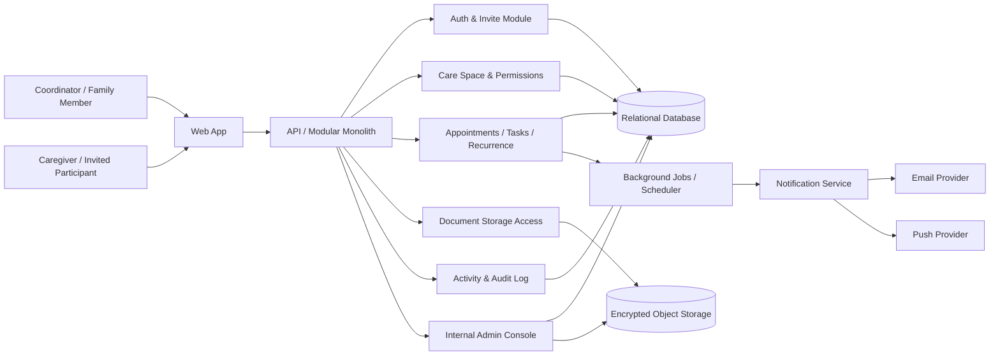

## Architecture Notes
The main technical constraint is **sensitive care-data handling under French/EU privacy expectations**: this is not a generic task app, because you are storing health-adjacent information, documents, permissions, and notifications for multiple participants. The MVP should therefore be a **single-tenant-per-care-space, invitation-based web app** with a minimal backend, strict access checks, and an audit trail sufficient for trust and support.

### Macro architecture choice
Use a **modular monolith** behind a single API, with one web client and a small set of internal jobs. Avoid microservices, real-time collaboration complexity, and any deep medical integrations. The simplest viable shape is:
- authenticated web app
- care-space domain model
- role-based permissions
- background notification jobs
- object storage for documents
- admin/support console for manual operations

### Main technical dependency or constraint first
The biggest dependency is **consent, access control, and data retention design**:
- every item must belong to exactly one care space
- every user’s access must be explicit by invite and role
- document storage must be private by default
- reminders/notifications must not leak sensitive content
- the product must support account removal and data deletion flows

If this is not designed up front, the MVP is not safe to run with real families.

### Structural technical decisions that shape the MVP
1. **Care-space as the security boundary**  
   One relative, one care space, one closed participant list. No cross-space sharing in MVP.

2. **Role-based access with minimal granularity**  
   Start with a small set of roles such as:
   - coordinator
   - family member
   - caregiver
   - viewer  
   Keep permissions coarse; do not build configurable ACLs now.

3. **Asynchronous reminders, not collaborative messaging**  
   Use notifications and status updates, but do not build a full chat system. Notes can exist as structured updates on tasks/items.

### One recommended implementation approach
Build the MVP as:
- **Frontend:** mobile-friendly web app, responsive first, no native app initially
- **Backend:** REST or simple GraphQL API in a single monolith
- **Auth:** email-based invite login or passwordless magic links
- **Database:** relational DB for users, care spaces, items, permissions, reminders, audit events
- **Documents:** encrypted object storage with signed access URLs
- **Jobs:** scheduled worker for reminder delivery and recurring item generation
- **Admin:** internal support UI for invite recovery, permission fixes, and deletion requests

### What must be built now
- user authentication and invite acceptance
- care-space creation for one relative
- role assignment and permission enforcement
- appointments, tasks, recurring reminders, emergency contacts
- limited document upload/download
- structured notes or updates on items
- notification delivery
- simple timeline/dashboard view
- internal admin/support tooling for manual correction
- basic audit logging for access and changes

### What can be handled manually or operationally first
- onboarding and first care-space setup
- importing the first appointments/tasks/documents
- explaining privacy and consent boundaries
- support for permission mistakes
- moderation of invite issues and user recovery
- manual nudges if reminders fail during pilot
- any caregiver enrollment assistance

### Main modules or components
- **Identity & Invite Service**: user login, invite acceptance, session management
- **Care Space Module**: relative profile, participant list, role assignment
- **Coordination Module**: appointments, tasks, recurring items, responsibility ownership
- **Reminder Module**: scheduled notification generation and delivery tracking
- **Document Module**: restricted file upload, storage, retrieval
- **Activity/Audit Module**: immutable log of key actions for support and trust
- **Admin Console**: user support, access correction, deletion handling
- **Notification Adapter**: email first, push only if needed and reliably supported

### Critical data or workflow states
- care space created
- invite sent
- invite accepted
- role assigned
- item created
- item assigned
- reminder scheduled
- reminder delivered / failed
- item completed
- document uploaded
- document accessed
- participant removed
- access revoked
- care space archived / deleted

### Minimum reliability, data, permission, or control requirements
- strict tenant isolation by care space
- server-side authorization on every read/write
- signed URLs for document access with short expiry
- notification idempotency to avoid duplicate reminders
- retry and dead-letter handling for failed notifications
- audit trail for invitations, role changes, document access, deletions
- basic rate limiting and abuse prevention on invites/login
- data export/delete capability for GDPR readiness

### Control points, internal tools, or support needs
- internal admin panel to resend invites, revoke access, and fix participant states
- support view of care-space membership and recent actions
- manual deletion workflow for GDPR requests
- notification delivery monitoring
- basic error logging and alerting for failed jobs
- back-office checklist for onboarding and trust explanation

### Mermaid Diagram

## Review Summary
The key feasibility issue is not feature breadth but **safe coordination of sensitive care information in a closed family-and-caregiver space**. The MVP should stay narrow: one relative, one care space, invitation-only access, structured tasks/appointments, limited documents, and email-first reminders, with manual onboarding and support to compensate for the lack of automation.

## Critical Assumptions
- The MVP can remain within a single care space per relative without needing household or multi-relative support.
- Families will accept invitation-based access and email-first notifications for the pilot.
- The product can avoid full messaging and still prove coordination value through structured updates and reminders.
- Basic role separation between coordinator, family member, and caregiver is sufficient for trust in the first release.
- GDPR-compliant account deletion, access restriction, and audit logging are enough for the pilot without deeper enterprise controls.

## Requested Changes
- Define one explicit care-space security boundary per relative and prohibit cross-space sharing in MVP [scope]
- Replace “secure messaging system” with structured notes/updates on tasks and appointments [scope]
- Specify an email-first notification policy and make push optional, not required for launch [onboarding]
- Add a minimum audit trail for invites, permission changes, document access, and deletions [privacy_trust]
- Clarify the exact role model and what each role can read, edit, and share [privacy_trust]

## Risks
- Health-adjacent data may trigger privacy expectations that the MVP cannot safely meet if controls are weak [privacy_trust]
- Reminder delivery failures or duplicate notifications could quickly destroy trust [operational_reliability]
- Overlapping permissions between family and caregivers may create accidental disclosure [access_control]
- A document vault can become a liability if access and deletion are not rigorous [data_governance]
- Building chat-like features too early will increase complexity without proving the core coordination loop [scope]

## Open Questions
- Which data elements are considered mandatory versus optional in the first release, especially around medication and documents?
- Should caregivers have write access to tasks and notes, or read-only access initially?
- Is email sufficient for all reminder flows during pilot, or must push be supported from day one?
- What deletion/export guarantee is required for French deployment of this sensitive data?
- Do documents need sharing links between participants, or only in-app authenticated access?

## Why This Could Fail Even With Good Execution
Even if the implementation is solid, the product can still fail if families perceive the trust burden as too high for the value delivered. If sharing care information feels risky or cumbersome, they will stay on WhatsApp, paper, and phone calls, and the coordination benefit will not overcome that friction.

## Technical Readiness
Status: LIMITED

Blocking Gaps:
- The privacy, consent, and access-control model for sensitive care data in France is not fully specified [privacy_trust]
- The reminder and notification delivery model is not yet pinned to a reliable first channel and failure policy [operational_reliability]
- The document handling model is too vague for safe implementation without deletion, access, and audit rules [data_governance]

Required Improvements:
- Define the minimum French privacy posture, role permissions, and consent flow before build [privacy_trust]
- Choose the first notification transport and define retry/failure handling [operational_reliability]
- Specify document storage, access expiry, audit logging, and deletion behavior [data_governance]