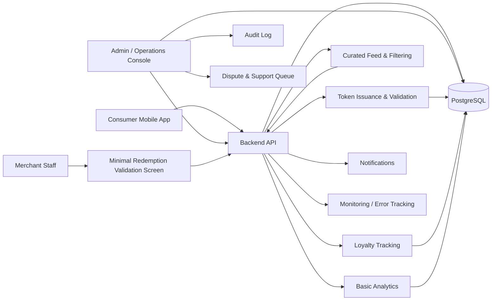

## Architecture Notes
The main constraint is not app development; it is whether supply quality can be controlled tightly enough in a live Paris pilot to avoid an empty or noisy feed. For MVP, this should be a concierge-operated, single-city system with manual merchant approval and a very small number of live merchants, backed by a lightweight backend that supports curated listings, one-time redemption tokens, and basic auditability.

### Macro architecture choice
Use a **mobile client + simple API backend + admin operations console + relational database** architecture. Keep all merchant curation, approval, and support actions inside an internal console. Do **not** build self-serve merchant onboarding, automated recommendation, or open reviews for MVP.

### Main technical dependency or constraint
The decisive dependency is a **reliable in-store redemption control** that is simple enough for staff to execute without confusion. Without a clear token lifecycle and merchant verification step, the loyalty loop and offer validation will fail at the point of visit.

### Structural technical decisions
1. **Manual supply gating before publish**
   - Every merchant must pass a checklist and be explicitly approved by ops before becoming visible.
   - This is the key quality-control mechanism for MVP supply.

2. **Single redemption model**
   - Use one token format only: a short-lived, single-use QR code or alphanumeric code shown in-app.
   - Merchant validation must be through the ops console or a minimal merchant validation page.

3. **Curated feed over algorithmic ranking**
   - The app should show only approved, active merchants in the selected Paris cluster.
   - Ordering can be manual or rule-based; personalization can wait.

### Recommended implementation approach
Build a **thin mobile app** backed by a **REST API** and a **PostgreSQL database**, with a **web-based internal admin console** for merchant approval, offer management, redemption oversight, and dispute handling. Merchant-facing functionality can stay manual or be limited to a minimal validation screen if needed.

### What must be built now
- Consumer mobile app
- Nearby curated feed for the fixed Paris cluster
- Merchant profile page
- Offer display
- One redemption flow with a single token type
- Loyalty state tracking for repeat visits
- Basic merchant analytics
- Internal admin console
- Audit log for manual changes
- Merchant quality checklist workflow
- Merchant live/inactive approval gate
- Dispute flagging and resolution workflow

### What can be handled manually or operationally first
- Merchant sourcing and onboarding
- Offer creation and copywriting
- Feed curation and live/inactive management
- Neighborhood selection and inventory balancing
- Customer support for failed redemptions
- Manual validation of ambiguous redemption cases
- Quality review of images, descriptions, and business details

### Main modules or components
- **Mobile app**
  - discovery feed
  - merchant detail page
  - redeem token flow
  - user preference capture

- **API backend**
  - merchant catalog
  - offer state
  - token issuance and validation
  - loyalty event recording
  - analytics event ingestion

- **Admin console**
  - merchant approval
  - checklist completion
  - publish/unpublish control
  - dispute handling
  - override actions
  - activity review

- **Database**
  - merchants
  - offers
  - users
  - redemptions
  - loyalty events
  - audit logs
  - support cases

### Critical data or workflow states
- Merchant: `draft -> reviewed -> approved -> live -> inactive`
- Offer: `draft -> active -> expired -> paused`
- Token: `issued -> displayed -> validated -> consumed` or `expired` or `voided`
- Redemption: `pending -> confirmed -> disputed -> resolved`
- Loyalty: `eligible -> earned -> redeemed`
- Support case: `open -> investigating -> resolved`

### Minimum reliability, data, permission, or control requirements
- One-time tokens must be **single-use**, **time-limited**, and **merchant-specific**
- Consumption must be **idempotent** to prevent double redemption
- Audit log must record every manual state change
- Only ops/admin roles can publish merchants or override redemptions
- Merchant data must have a required checklist before live status
- Failed or ambiguous validations must have a supported dispute path
- The app must block stale or inactive offers from appearing

### Control points, internal tools, or support needs
- Internal checklist completion before activation
- Manual publish gate for each merchant
- Support queue for redemption issues
- Override permissions for token disputes
- Daily review of stale offers and inactive merchants
- Basic merchant health monitoring: views, redemptions, repeat visits, continuation status

### Smallest quality-control mechanism for MVP
The minimum viable quality-control mechanism is a **mandatory pre-live merchant checklist plus manual approval**. A merchant cannot go live unless all required fields pass review:
- correct name, address, and category
- verified opening hours
- one approved offer
- at least one photo
- clear redemption instructions
- confirmed in-store acceptance
- ops owner assigned
- active/inactive status confirmed

This should be enforced in the admin console as a required gate, not as a guideline.

For redemption reliability, the smallest credible flow is:
1. User taps redeem.
2. Backend issues a single-use token with expiry.
3. Merchant sees the token in a minimal validation screen or admin-assisted lookup.
4. Merchant marks it consumed only after successful in-store confirmation.
5. If validation fails, the token cannot be reused; the case is marked disputed for support review.

This keeps the MVP controlled without building a complex POS integration.

### Mermaid Diagram

## Review Summary
The MVP is only feasible if LocalLoop is treated as a tightly controlled concierge system, not a marketplace. The critical path is merchant quality control plus a simple, reliable redemption mechanism; everything else should remain manual until the pilot proves that curated Paris supply can sustain repeat visits.

## Critical Assumptions
- Merchant onboarding can be kept small enough that every live listing is reviewed manually.
- One token-based redemption method is sufficient for pilot operations.
- The pilot can tolerate some manual support for disputes without breaking the user experience.
- A fixed Paris cluster can support enough active merchants to avoid a thin feed.
- Ops can keep merchant status, offers, and stale listings current with lightweight tooling.

## Requested Changes
- Define the merchant quality checklist as a required publish gate in the admin console, not a manual guideline. [quality_assurance]
- Specify the exact redemption token lifecycle: issued, expiring, consumed, disputed, voided. [quality_assurance]
- Constrain merchant activation to one ops-approved live state with no self-serve publishing. [quality_assurance]
- Add an explicit stale-offer suppression rule so inactive merchants cannot appear in the feed. [quality_assurance]
- Require an audit log entry for every manual override, publish, or dispute resolution action. [quality_assurance]

## Risks
- Manual approval may become a bottleneck if merchant onboarding volume rises too quickly. [ops_scalability]
- Token validation may fail at the point of visit if merchant staff do not have a simple enough process. [redemption_friction]
- Poorly controlled supply may still create a feed that feels thin or inconsistent. [quality_assurance]
- Support load may increase if dispute handling is not tightly constrained. [support_load]
- Merchant data quality may degrade if checklist enforcement is not strictly mandatory. [quality_assurance]

## Open Questions
- Should merchant validation be done by an ops staffer, or by merchant staff through a minimal validation screen?
- What exact expiry window should the one-time token use to balance safety and in-store usability?
- Which fields are mandatory for the quality checklist before a merchant can go live?
- Should disputed redemptions be reversible, or only manually credited after support review?
- What is the minimum merchant count per cluster before the feed is allowed to go public?

## Why This Could Fail Even With Good Execution
Even with strong execution, the project can fail if the chosen Paris cluster cannot maintain enough high-quality, repeat-worthy merchants to justify the app’s existence. In that case the architecture will work, but the product will still feel like a small curated directory rather than a dependable local discovery habit.

## Technical Readiness
Status: LIMITED

Blocking Gaps:
- The merchant quality gate is not yet defined as a hard publish control with required fields and approval state. [quality_assurance]
- The redemption token lifecycle is still too implicit to guarantee reliable in-store use. [redemption_friction]
- The merchant validation path is not fixed, so staff-side execution could be inconsistent. [redemption_friction]

Required Improvements:
- Implement a mandatory pre-live checklist in the admin console with required fields and approval lockout. [quality_assurance]
- Define the single redemption token format, expiry, consumption, and dispute states. [quality_assurance]
- Choose one validation path for merchants and keep it operationally minimal for MVP. [redemption_friction]