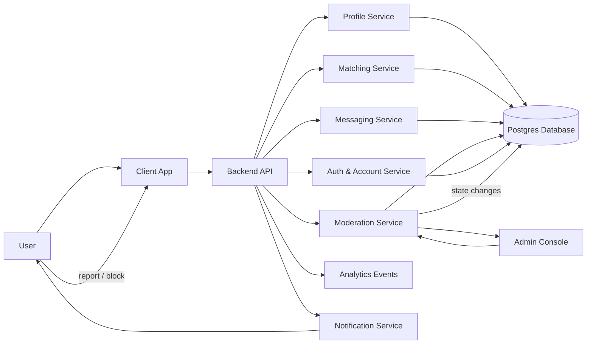

## Architecture Notes
The decisive technical constraint is **supply quality control under low-density conditions**: if Paris onboarding data is inconsistent or low-signal, matching quality collapses before the product can prove anything. The simplest viable MVP is therefore a **manual-approval, database-driven matching app** with a hard profile state machine, not an automated social network.

### Macro architecture choice
Use a **single web/mobile client + lightweight backend API + relational database** architecture. Keep matching logic simple and deterministic. Add an admin review tool for supply validation before profiles become visible or matchable. Do not build event ingestion, marketplace, feeds, or recommendation infrastructure now.

### Main technical dependency or constraint first
The core dependency is a **minimum viable quality-control gate on user submissions**:
- every profile must pass through `pending_review` before becoming `active`
- matchability depends on required music fields being complete and valid
- manual review is acceptable during the pilot because density is more important than automation

Without this gate, the app will fill with weak or spammy profiles and the matching pool will not be trustworthy enough to test the wedge.

### Structural technical decisions
1. **Hard profile state machine**
   - `draft` → `pending_review` → `active` → `reported` / `suspended`
   - only `active` profiles appear in matching
   - moderators can move profiles back to `pending_review` or suspend them

2. **Minimum music submission schema**
   - require top artists, genres, one identity prompt, one intent, and one Paris scene
   - store normalized values where possible, but allow free-text entry initially
   - reject or hold profiles that do not meet completeness rules

3. **Manual review over automated trust scoring**
   - for the pilot, review submissions and reports in an internal admin console
   - keep automation limited to simple checks: required fields, duplicate detection, obvious abuse signals

### Recommended implementation approach
Build a **single Rails/Next.js-style product with Postgres** and a basic admin interface. Keep the matching algorithm as a transparent scoring function over artist and genre overlap plus coarse location/scene alignment. Use a small operational team to approve profiles and review reports daily.

### What must be built now
- account creation and authentication
- profile onboarding with required music fields
- hard validation of minimum submission completeness
- profile review queue
- `pending_review` / `active` / `reported` / `suspended` state handling
- matching list generation for active profiles only
- basic messaging after match
- report and block flows
- simple admin dashboard for review and moderation
- audit trail for moderation actions
- basic analytics on activation, match, message, report, and suspension rates

### What can be handled manually or operationally first
- screening first users before invite
- approving borderline profiles manually
- balancing supply by scene and intent
- curating the first cohort
- reviewing suspicious behavior
- prompting first-message follow-up and meetup outcomes

### Main modules or components
- **Client app**: onboarding, profile view, match list, messaging, reporting
- **API layer**: auth, profile CRUD, match retrieval, messaging, moderation actions
- **Profile service**: required field validation, state transitions, activation gating
- **Matching service**: simple compatibility scoring and candidate filtering
- **Messaging service**: match-only conversations
- **Admin console**: review queue, profile approval, reports, suspension
- **Postgres database**: users, profiles, preferences, states, matches, messages, reports, audit log
- **Monitoring/analytics**: event tracking and operational dashboards

### Critical data or workflow states
- `draft`: profile started but incomplete
- `pending_review`: required fields complete, awaiting approval
- `active`: eligible for discovery and matching
- `matched`: mutual match created
- `messaging_enabled`: conversation available after match
- `reported`: flagged by users, hidden from matching until reviewed
- `suspended`: removed from the active pool

### Minimum reliability, data, permission, or control requirements
- enforce required fields server-side, not just in UI
- only active profiles can be matched
- only matched users can message each other
- blocks must be symmetric and immediate
- reports must hide profiles from discovery pending review
- moderation actions must be logged with actor, reason, and timestamp
- admin access must be role-based and restricted
- data retention and deletion must be possible for account removal requests

### Control points, internal tools, or support needs
- internal review queue for new profiles
- moderation console for reports and suspensions
- manual duplicate or spam checks
- support workflow for account recovery and safety issues
- basic export of audit and engagement data for pilot analysis

### Mermaid Diagram

## Review Summary
The main feasibility issue is not feature breadth but **whether low-volume Paris supply can be kept high-quality enough to trust the matching pool**. The MVP should therefore be built around a hard review gate, a small state machine, and manual moderation support, with everything else kept minimal and deterministic.

## Critical Assumptions
- A manual review step is acceptable for the pilot cohort size.
- The team can reliably validate required music fields before activation.
- A single relational database can support the full MVP workflow.
- Matching can stay simple without harming the proof.
- Moderation volume will remain manageable in a Paris-only launch.

## Requested Changes
- Add an explicit `pending_review` state before any profile becomes discoverable [quality_assurance]
- Define the minimum required onboarding schema for activation: top artists, genres, identity prompt, intent, and Paris scene [quality_assurance]
- Clarify that only `active` profiles can appear in match results [scope]
- Add a moderator review queue and audit log to the MVP scope [operations]
- Specify that report/block actions immediately remove a user from matching pending review [privacy_trust]

## Risks
- Manual review may become a bottleneck if invite volume grows faster than expected [operations]
- Weak or inconsistent music input will reduce match quality even if the product works technically [quality_assurance]
- Abuse or spam may bypass review if submission rules are too loose [privacy_trust]
- Matching quality may still be poor if the underlying Paris cohort is too small [demand_validation]
- Admin moderation could be underbuilt and create trust issues if not auditable [privacy_trust]

## Open Questions
- What exact fields are mandatory for a profile to move from `draft` to `pending_review`?
- How many profiles per day can the team manually review during the pilot?
- Should approval be required before first visibility, or only before first match?
- What moderation SLA is needed for reports and blocks in a pilot setting?
- What is the minimum acceptable completeness threshold for music preferences?

## Why This Could Fail Even With Good Execution
Even if the system is built correctly, the project can still fail if the required music input does not produce enough high-confidence compatibility signals. In that case, the app will run safely but the matches will feel arbitrary, and the product will not justify itself as music-native rather than just a lightly themed social app.

## Technical Readiness
Status: LIMITED

Blocking Gaps:
- The minimum profile quality-control mechanism was not fully specified and must be enforced before activation [quality_assurance]
- The profile state model needs a hard `pending_review` gate to prevent low-quality supply from entering matching [quality_assurance]
- Moderation handling is missing an explicit audit trail and review queue for trust enforcement [privacy_trust]

Required Improvements:
- Define and implement the required music submission schema and completeness rules [quality_assurance]
- Add a profile state machine with `draft`, `pending_review`, `active`, `reported`, and `suspended` states [quality_assurance]
- Build a small admin review console with logged moderation actions [operations]