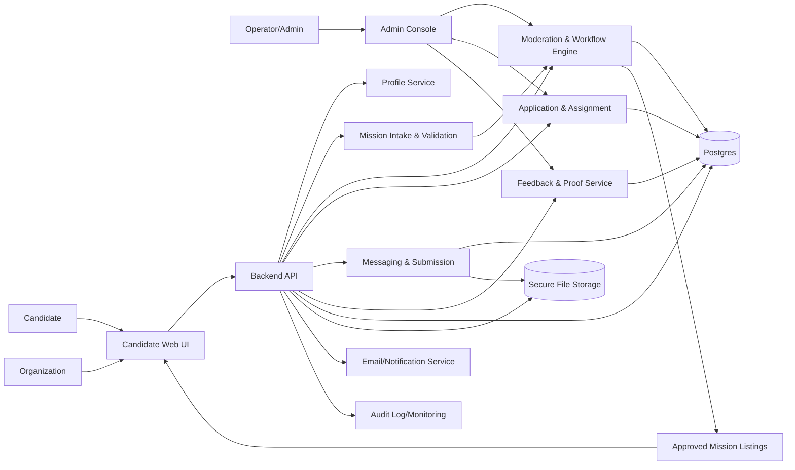

## Architecture Notes
The decisive technical constraint is **quality control of mission supply**: without a hard moderation gate and bounded mission schema, the product will drift into free-labor postings or generic freelancing before any marketplace proof is possible.

A simple MVP architecture is a **concierge-led, admin-governed web platform** with a strict mission state machine. Build a small transactional application with:
- a public candidate/organization frontend,
- an internal moderation and matching console,
- a core workflow API,
- and a relational database as the source of truth.

### Main technical dependency or constraint
The platform depends on the ability to **approve only bounded, structured missions** before publication. That requires:
- a fixed mission taxonomy,
- mandatory structured fields,
- moderation states,
- rejection reasons,
- and proof issuance only after completion feedback is recorded.

### Structural technical decisions that shape the MVP
1. **Hard mission schema, not free-form posting**  
   Missions must be created from a constrained form with required fields: category, objective, deliverable, duration, effort range, location mode, compensation status, and review method. This is the main quality-control mechanism.

2. **Manual approval with state machine gating**  
   No mission is visible until it moves through explicit states such as `draft -> submitted -> under_review -> approved/rejected -> published -> matched -> in_progress -> submitted_for_review -> completed -> proof_issued`. This is the core trust control.

3. **Internal matching and proof issuance are operator-controlled**  
   Matching should stay manual in the pilot. Proof-of-work artifacts should be generated only after structured completion feedback exists. Do not automate reputation or ranking in MVP.

### Recommended implementation approach
Build a **single monolithic web app** with role-based access control and a Postgres database. Use one backend service and two UI surfaces:
- external portal for candidate/org submission and mission browsing,
- internal admin console for review, approval, matching, and completion verification.

### What must be built now
- Candidate profile creation
- Organization profile creation with identity/commitment fields
- Constrained mission posting form
- Mission moderation queue
- Publish/reject workflow with reasons
- Mission listing for approved missions only
- Candidate application submission
- Internal matching assignment
- Basic messaging or controlled contact thread
- Deliverable submission
- Completion confirmation
- Structured feedback form
- Proof-of-work artifact generation
- Audit trail of moderation and status changes

### What can be handled manually or operationally first
- Sourcing organizations
- Legal wording review for France
- Screening mission quality before approval
- Matching decisions
- Deliverable review if unclear
- Dispute handling
- Candidate onboarding
- Repeat outreach to organizations

### Main modules or components
- **Auth and roles**: candidate, organization, operator/admin
- **Profile service**: basic identity, skills, availability, organization details
- **Mission intake module**: strict template, validation, submission
- **Moderation module**: review queue, approve/reject, rejection reasons
- **Marketplace module**: browse approved missions, apply
- **Assignment module**: manual match and state transitions
- **Messaging module**: minimal thread per mission or controlled comment thread
- **Submission module**: upload/link deliverables
- **Feedback module**: structured completion review
- **Proof module**: generate standardized proof artifact
- **Audit/logging module**: status changes, moderator actions, issuance history
- **Admin console**: internal control surface for all gated workflows

### Critical data or workflow states
Mission states should be explicit and enforceable:
- `draft`
- `submitted`
- `under_review`
- `approved`
- `rejected`
- `published`
- `applied`
- `assigned`
- `in_progress`
- `submitted_for_review`
- `completed`
- `proof_issued`
- `closed`

Critical data objects:
- user profile
- organization profile
- mission template fields
- moderation decision and reason
- application record
- assignment record
- message thread
- deliverable submission
- feedback record
- proof artifact record

### Minimum reliability, data, permission, or control requirements
- Role-based access control for candidates, organizations, operators
- Only operators can approve, reject, assign, and issue proof
- Validation of required mission fields at form level and API level
- Immutable audit log for moderation and proof issuance
- Proof cannot be generated without completed feedback
- Rejection reasons must be structured, not free text only
- Attachments and links must be stored securely with access control
- Basic rate limits and anti-abuse checks on applications and submissions
- Data retention and consent controls for French privacy expectations

### Control points, internal tools, or support needs
- Internal review queue with filters for taxonomy, location, compensation status, and duration
- Operator notes on each mission
- Rejection templates for consistent moderation
- Assignment screen for manual matching
- Completion review screen with structured feedback fields
- Proof generation screen with operator confirmation
- Support inbox or lightweight case log for disputes and clarifications

### What the smallest quality-control mechanism must be
For MVP, the smallest credible control is:
- a **fixed mission taxonomy**
- a **mandatory moderation state machine**
- **required review fields**
- **structured rejection reasons**
- **proof issuance gated by completion feedback**

This is enough to reduce abuse without building a complex reputation or algorithmic trust layer.

### Mermaid Diagram

## Review Summary
The MVP is feasible only if it is built as a tightly controlled concierge platform, not as an open marketplace. The main correction is to formalize mission quality control as a hard moderation workflow with a fixed taxonomy, approval gating, and proof issuance only after structured feedback.

## Critical Assumptions
- A small fixed mission taxonomy is enough to filter unsafe or labor-like postings.
- Manual moderation can keep volume low enough for the pilot.
- Operators can reliably distinguish bounded starter missions from freelance work.
- Structured feedback is sufficient to justify proof-of-work issuance.
- The team can maintain a clear audit trail for moderation and completion decisions.

## Requested Changes
- Add a **mandatory moderation state machine** for every mission, with `submitted`, `under_review`, `approved`, `rejected`, and `published` as enforced states. [quality_assurance]
- Add a **fixed mission taxonomy** at form validation time so organizations cannot submit open-ended or unclassified work. [scope]
- Add **structured rejection reasons** in the admin workflow so moderation decisions are consistent and auditable. [quality_assurance]
- Gate **proof-of-work generation** on mandatory structured completion feedback from the organization. [quality_assurance]
- Make the **approval queue an internal control surface** rather than a passive content review step. [quality_assurance]

## Risks
- Moderation may become the bottleneck if the taxonomy is too broad or approvals are too manual.
- Organizations may still attempt to stretch bounded missions into ongoing labor.
- Proof artifacts may lose credibility if completion feedback is inconsistent.
- The product may feel too constrained if the taxonomy is not well-designed.
- Audit and permission controls may be underbuilt if the team treats this as a lightweight marketplace.

## Open Questions
- What are the exact 3 to 5 mission categories allowed at launch?
- Which fields are mandatory to classify a mission as bounded and safe?
- What minimum feedback schema is needed before proof issuance?
- Which user roles can edit, approve, assign, or revoke a mission?
- What evidence must be stored to audit moderation decisions later?

## Why This Could Fail Even With Good Execution
Even with solid implementation, the project can fail if the taxonomy cannot reliably separate safe starter missions from disguised freelance or unpaid labor. If the boundary is ambiguous, moderation becomes subjective, trust degrades, and the platform will either over-reject useful missions or accept risky ones.

## Technical Readiness
Status: LIMITED

Blocking Gaps:
- Mission quality control is not yet formalized into an enforced workflow [quality_assurance]
- The launch taxonomy is not yet specified tightly enough to enforce scope [scope]
- Proof-of-work issuance is not yet tied to structured completion feedback [quality_assurance]

Required Improvements:
- Implement a mandatory moderation state machine with publish gating and rejection reasons [quality_assurance]
- Define a small fixed mission taxonomy and enforce it at form validation time [scope]
- Require structured completion feedback before generating the proof artifact [quality_assurance]